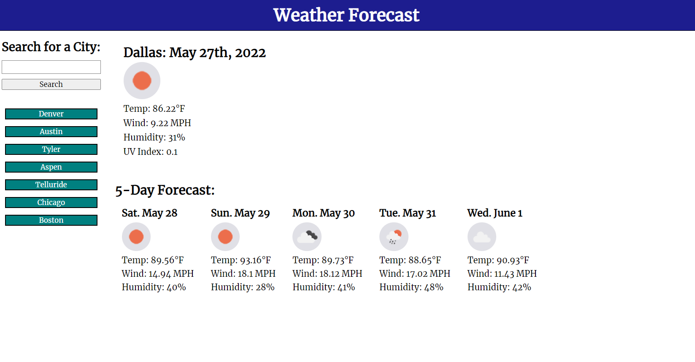

## Weather Dashboard

This web application's purpose is to generate the current weather and the future 5-day forecast by city.

## How it Works
This application fetches data from the OpenWeatherAPI with my specific APIKey variable in JavaScript. When the uses searches a city in the top left, the current forecast will appear with the city, data, weather icon, temp, wind speed, humidity percentage and the current UV index. Below the current weather, the 5day extended forecast will show for that city pulling the same data, minus the UVI. When you refresh the page, the previously searched cities appear below the search bar. I also created a local storage key to save the applications searched data. Lastly, the UVI will appear green if the Index value us low, yellow if moderate, and red if that number is higher than 6.

* **OpenWeatherAPI**: I used Geocoding API to fetch the {city}'s current & extended forecast data, and OneCall to fetch the {lat} & {lon} data for the UVI to display. 

* **HTML**: I built very little in the HTML for this application. Mainly built <divs> and #ids to be used in the CSS stylesheet and JavaScript.  However, I did add a favicon link & a google fonts link to give my application a unique style.

* **CSS**: Within the stylesheet, I added many flexbox features to the <divs> for the application to become responsive across several devices for the user.

* **JavaScript**: The script file makes all the magic happen when the search button is clicked. Fetching the API URLs using my APIKey and other specific parameters I requested, created the functionality for the current weather and extended forecast to display. I built a for loop to run 5x for the extended forecast, and used IDs to pull the current forecast.

## Mock up
The following screenshot shows the web application's appearance:

To view this web application, [click here](https://lindsey-lansford.github.io/weather-forecast-dash/)